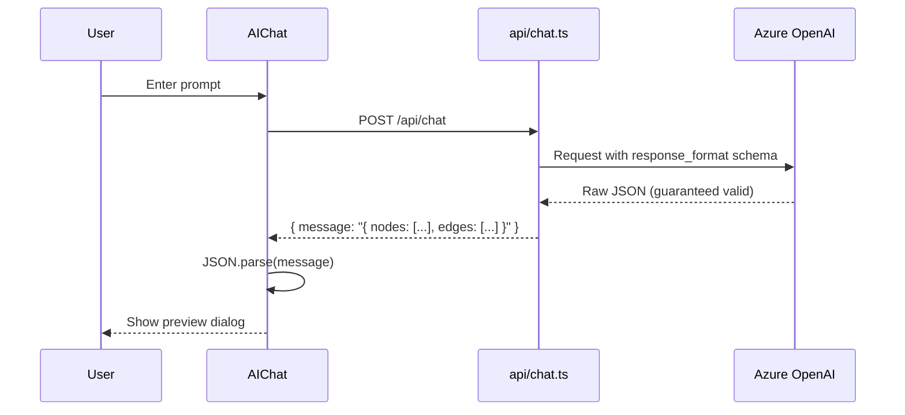
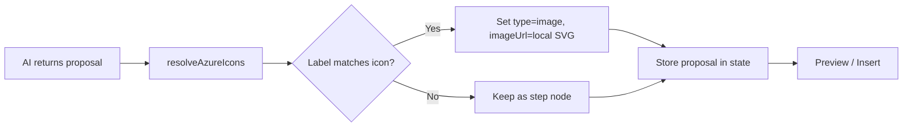

# FlowChart Designer

A modern, interactive flowchart designer built with Vite, React, TypeScript, and React Flow. Create beautiful flowcharts with AI assistance powered by Azure OpenAI, complete with dark mode, presentation mode, and a library of 663+ Azure service icons.

## Features

### Core Canvas
- **Interactive Canvas** with dotted grid background and snap-to-grid (15px)
- **Dark / Light Mode** toggle with full theme support across canvas, nodes, edges, and UI
- **Undo / Redo** with keyboard shortcuts (`Ctrl+Z` / `Ctrl+Y`) and a 10-state history stack
- **Copy / Paste / Cut** with smart ID remapping and offset positioning
- **Auto-fitting Minimap** that appears when content exceeds the viewport
- **Dynamic Canvas Boundaries** that scale with content to prevent over-panning

### Tool Modes
Switch modes via the toolbar or keyboard shortcuts:
| Mode | Shortcut | Description |
|------|----------|-------------|
| **Select** | `V` | Drag to select, reposition nodes, edit labels |
| **Hand** | `H` | Pan the canvas freely |
| **Arrow** | `A` | Draw connections between nodes |

### Node Types
- **Step** — Rounded rectangles for process steps
- **Decision** — Diamond shapes for branch logic (aspect-ratio locked)
- **Note** — Sticky-note style with multi-line editing
- **Image** — Display Azure service icons or uploaded images with a label beneath

All nodes support:
- Inline label editing (double-click)
- Resizing via corner/edge handles (with per-type minimum dimensions)
- 4 connection handles (top, right, bottom, left)
- Visual hover and selection states

### Edge Features
- **Editable Labels** — Double-click a selected edge to add or edit its label
- **Multiple Styles** — Default (bezier), Smooth Step, Step, and Animated Dashed
- **Reconnection** — Drag an edge endpoint to reroute it to a different node
- **Visual Feedback** — Animated dashed line and crosshair cursor while drawing connections

### Multi-Select
- Drag a selection box to select multiple nodes and edges
- Bulk actions toolbar: **Delete**, **Copy**, **Paste**, and **Edge Style** picker
- Keyboard: `Delete` to remove, `Ctrl+C` / `Ctrl+V` to copy/paste

### Sidebar — Explorer
- **Visual Mode**: Browse all nodes and edges, edit labels inline, reorder via drag-and-drop, view edge style badges
- **JSON Mode**: View and edit the raw flowchart JSON, copy to clipboard, apply changes with validation
- Smooth slide-in animation with backdrop dismiss

### Sidebar — AI Assistant
- **Welcome Experience**: Floating prompt on an empty canvas with starter suggestions
- **Chat Interface**: Full-screen overlay with conversation threads (session-persisted, 30 min TTL)
- **47+ Starter Prompts** across categories — casual, fitness, technical, business
- **Loading Feedback**: Progress bar with rotating status messages

### AI Flowchart Generation
- Describe what you need and the AI generates a complete flowchart proposal
- **Structured Outputs** enforce a strict JSON schema so the response is always valid
- **Proposal Preview Dialog** with:
  - Summary of the generated flowchart
  - Fullscreen toggle (auto-enabled for 8+ nodes)
  - **Insert** — add to canvas, **Cancel** — dismiss, **Present** — jump into presentation mode
  - **Refinement Sidebar** — iteratively refine the proposal via follow-up messages
- **Azure Icon Enrichment** — automatically resolves service names to matching icons (100+ aliases)

### Azure Icon Library
- **663+ Azure service SVGs** bundled locally (no external calls)
- **Image Picker** with search, category filtering, and a Popular tab
- **Upload Tab** for custom images (PNG, JPG, SVG) with label editing
- Icons render correctly in both dark and light mode

### Presentation Mode
- Step-by-step node reveal following the node order
- Progressive edge display (edges appear once both endpoints are visible)
- Active node highlighting with auto-fit viewport
- Navigate with **Next / Previous** buttons, **Arrow keys**, or **Space**
- Press **Escape** to exit back to the editor

### Keyboard Shortcuts

| Shortcut | Action |
|----------|--------|
| `V` / `H` / `A` | Select / Hand / Arrow tool |
| `Ctrl+Z` | Undo |
| `Ctrl+Y` or `Ctrl+Shift+Z` | Redo |
| `Ctrl+C` / `Ctrl+V` / `Ctrl+X` | Copy / Paste / Cut |
| `Delete` | Delete selected |
| `Ctrl+Scroll` | Zoom in/out (smooth) |
| `←` / `→` / `Space` | Navigate in Presentation Mode |
| `Escape` | Exit modals, dialogs, or Presentation Mode |

## Setup

### Prerequisites
- Node.js 18+
- pnpm (or npm/yarn)

### Installation

1. Clone the repository
2. Install dependencies:
   ```bash
   pnpm install
   ```

3. (Optional) Configure Azure OpenAI for AI assistant:
   - Copy `.env.example` to `.env`
   - Fill in your Azure OpenAI credentials (server-side, never exposed to the browser):
     ```
     AZURE_DEPLOYMENT_NAME=your-deployment-name
     AZURE_RESOURCE_NAME=your-resource-name
     AZURE_API_KEY=your-api-key
     ```
   - Requires gpt-4o (2024-08-06) or newer for structured outputs support

### Development

Run the development server:
```bash
pnpm dev
```

### Testing

Run the test suite:
```bash
pnpm test
```

### Build

Create a production build:
```bash
pnpm build
```

Preview the production build:
```bash
pnpm preview
```

## Technology Stack

- **Vite** — Fast build tool and dev server
- **React 18** — Modern UI framework
- **TypeScript** — Type-safe development
- **React Flow** — Powerful flowchart rendering and interaction
- **@reactflow/node-resizer** — Node resize handles
- **Vitest** — Fast unit testing
- **Testing Library** — React component testing
- **Azure OpenAI** — AI-powered flowchart generation (structured outputs)
- **Vercel** — Serverless deployment and API functions

## Architecture

### AI Flowchart Generation

The AI assistant uses Azure OpenAI with **Structured Outputs** to guarantee valid JSON responses matching the flowchart schema.



**Key details:**
- **Structured Outputs**: The API enforces a strict JSON schema, ensuring the model always returns valid flowchart data
- **Server-side proxy**: API keys are kept secure on the server (`api/chat.ts`), never exposed to the browser
- **Flowchart skill**: A specialized system prompt (`api/flowchart-generation-skill.md`) guides the AI to create high-quality flowcharts
- **Truncation detection**: The system checks `finish_reason` to detect if responses were cut off due to token limits
- **Context-aware**: Includes current flowchart state so the AI can generate or refine alongside existing content

### Azure Icon Auto-Mapping

When the AI generates a flowchart involving Azure services, the system automatically resolves matching Azure service icons from the local icon library (663 SVGs) and upgrades plain step nodes to image nodes — no extra API calls required.



**How it works:**
- A frontend-only icon registry (`src/utils/azureIconRegistry.ts`) builds a lookup map at module-load time using Vite's `import.meta.glob`
- After the AI response is parsed, `resolveAzureIcons()` post-processes the proposal, matching node labels to Azure service icons via alias lookup, exact match, and substring match
- An `isAzureRelatedFlow()` gate prevents false positives on non-Azure flowcharts
- Icons render in both dark and light mode with adaptive background styling
- The alias map covers 100+ common phrasings (e.g., "Cosmos DB", "AKS", "App Service", "Redis Cache")

### Flowchart Schema

The AI generates flowcharts using this structure:

```json
{
  "summary": "Description of the flowchart",
  "nodes": [
    {
      "id": "1",
      "type": "step|decision|note|image",
      "label": "Node text",
      "position": { "x": 0, "y": 0 },
      "width": null,
      "height": null,
      "imageUrl": null
    }
  ],
  "edges": [
    {
      "id": "e1-2",
      "source": "1",
      "target": "2",
      "label": "Optional edge label",
      "style": "default|animated|step",
      "sourceHandle": "top|right|bottom|left",
      "targetHandle": "top|right|bottom|left"
    }
  ]
}
```

## License

MIT
