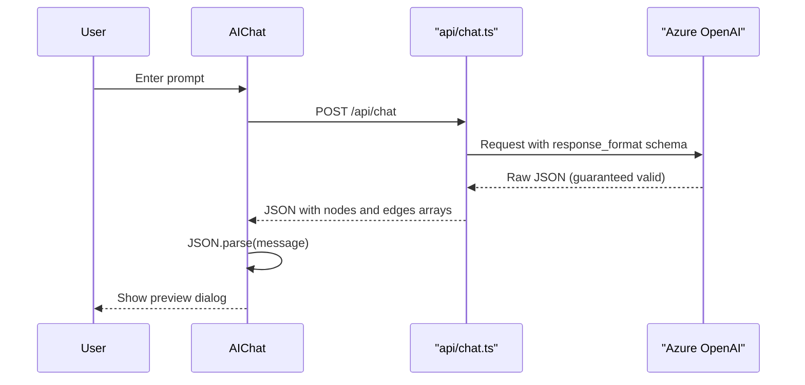

# FlowChart Designer

A modern, interactive flowchart designer built with Vite, React, TypeScript, and React Flow. Create beautiful flowcharts with AI assistance powered by Azure OpenAI.

## Features

### Core Functionality
- **Interactive Canvas**: Drag-and-drop interface for creating flowcharts
- **Multiple Node Types**: Step, Decision, and Note nodes
- **Flexible Connections**: Connect nodes with customizable edge styles
- **Edge Styles**: Choose from 4 edge styles:
  - Animated Dashed (default)
  - Default
  - Step
  - Smooth Step

### Node Capabilities
- **Editable Labels**: Double-click any node to edit its text
- **Smart Handles**: Decision nodes feature 8 handles (4 source, 4 target) for maximum flexibility
- **Drag & Drop**: Reposition nodes anywhere on the canvas
- **Delete**: Remove selected nodes and edges with the Delete key or toolbar button

### Presentation Mode
- **Full-Screen Preview**: Present your flowchart in a distraction-free view
- **Navigation**: Use Next/Previous buttons to step through nodes
- **Highlighting**: Active nodes are highlighted and centered automatically
- **Seamless Return**: Exit preview to return to editing with state preserved

### Sidebar Tools
- **Explorer View**: 
  - Browse all nodes and edges
  - Edit node names inline
  - See edge connections and styles
  
- **AI Assistant**:
  - Chat interface powered by Azure OpenAI
  - Context-aware flowchart assistance
  - Get suggestions for improving your flowchart

## Setup

### Prerequisites
- Node.js 18+ 
- pnpm (or npm/yarn)

### Installation

1. Clone the repository
2. Install dependencies:
   ```bash
   pnpm install
   ```

3. (Optional) Configure Azure OpenAI for AI assistant:
   - Copy `.env.example` to `.env`
   - Fill in your Azure OpenAI credentials (server-side, not exposed to browser):
     ```
     AZURE_DEPLOYMENT_NAME=your-deployment-name
     AZURE_RESOURCE_NAME=your-resource-name
     AZURE_API_KEY=your-api-key
     ```
   - Requires gpt-4o (2024-08-06) or newer for structured outputs support

### Development

Run the development server:
```bash
pnpm dev
```

### Testing

Run the test suite:
```bash
pnpm test
```

### Build

Create a production build:
```bash
pnpm build
```

Preview the production build:
```bash
pnpm preview
```

## Usage

### Creating a Flowchart
1. Click the "+ Step", "+ Decision", or "+ Note" buttons to add nodes
2. Drag nodes to position them on the canvas
3. Connect nodes by dragging from a source handle to a target handle
4. Double-click any node to edit its label

### Customizing Edges
- Select an edge and use the "Edge Style" dropdown to change its appearance
- Or set a default style for all new edges

### Using the Explorer
1. Click the "📋 Explorer" button to open the sidebar
2. View all nodes and edges in your flowchart
3. Edit node names directly in the list

### Using the AI Assistant
1. Click the "AI" button to open the AI chat bubble
2. Describe the flowchart you want to create (e.g., "Create a login flow with validation")
3. The AI generates a flowchart proposal with nodes and edges
4. Preview the proposal and click "Insert" to add it to your canvas
5. (Requires Azure OpenAI configuration)

**Tip**: The AI interprets any request as a flowchart process. Asking "make a song" will generate a flowchart of the song creation process.

### Presenting Your Flowchart
1. Click the "▶ Preview" button to enter presentation mode
2. Use "Next" and "Previous" to navigate through nodes
3. Press "Exit Preview" to return to editing

## Technology Stack

- **Vite**: Fast build tool and dev server
- **React 18**: Modern UI framework
- **TypeScript**: Type-safe development
- **React Flow**: Powerful flowchart library
- **Vitest**: Fast unit testing
- **Testing Library**: React component testing
- **Azure OpenAI**: AI-powered flowchart generation
- **Vercel**: Serverless deployment and API functions

## Architecture

### AI Flowchart Generation

The AI assistant uses Azure OpenAI with **Structured Outputs** to guarantee valid JSON responses matching the flowchart schema.



**Key features:**
- **Structured Outputs**: The API enforces a strict JSON schema, ensuring the model always returns valid flowchart data
- **Server-side proxy**: API keys are kept secure on the server (`api/chat.ts`), never exposed to the browser
- **Flowchart skill**: A specialized system prompt (`api/flowchart-generation-skill.md`) guides the AI to create high-quality flowcharts
- **Truncation detection**: The system checks `finish_reason` to detect if responses were cut off due to token limits

### Flowchart Schema

The AI generates flowcharts using this structure:

```json
{
  "summary": "Description of the flowchart",
  "nodes": [
    {
      "id": "1",
      "type": "step|decision|note|image",
      "label": "Node text",
      "position": { "x": 0, "y": 0 },
      "width": null,
      "height": null,
      "imageUrl": null
    }
  ],
  "edges": [
    {
      "id": "e1-2",
      "source": "1",
      "target": "2",
      "style": "default|animated|step",
      "sourceHandle": "top|right|bottom|left",
      "targetHandle": "top|right|bottom|left"
    }
  ]
}
```

## License

MIT

## Development

This project was built using the Ralph methodology for autonomous development.
