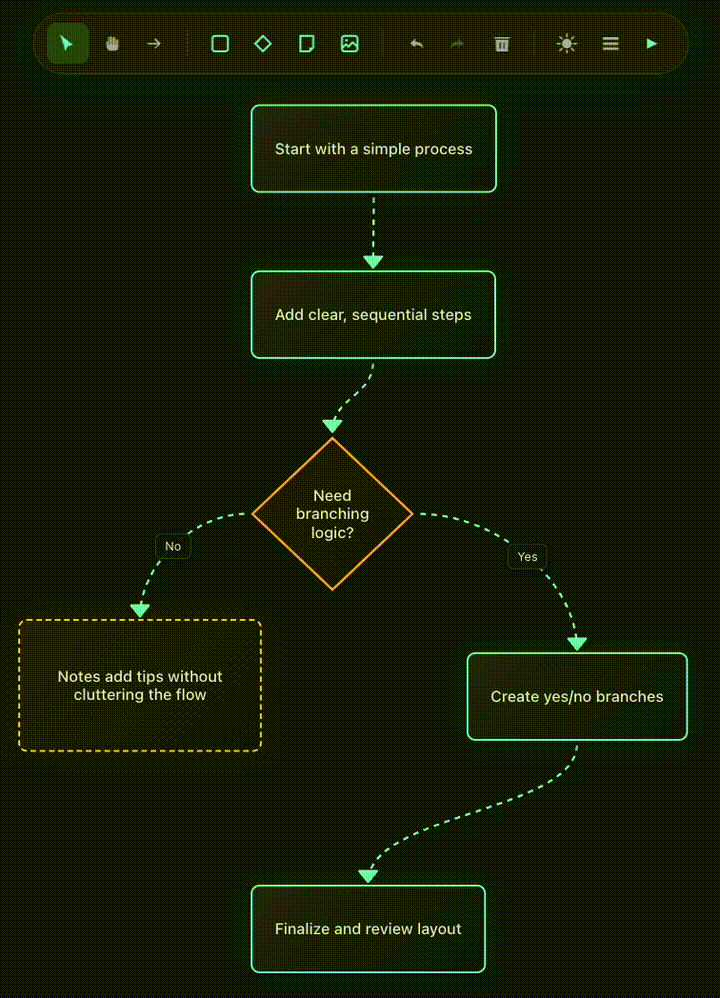
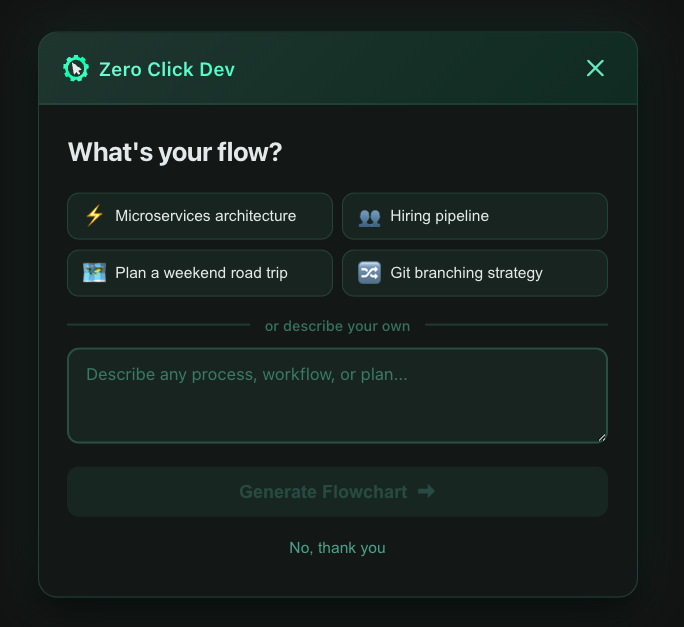
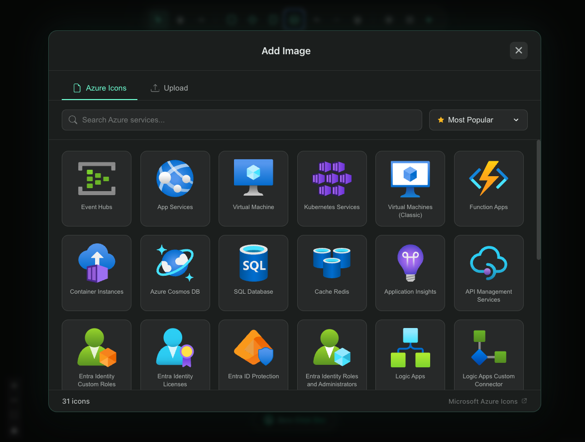
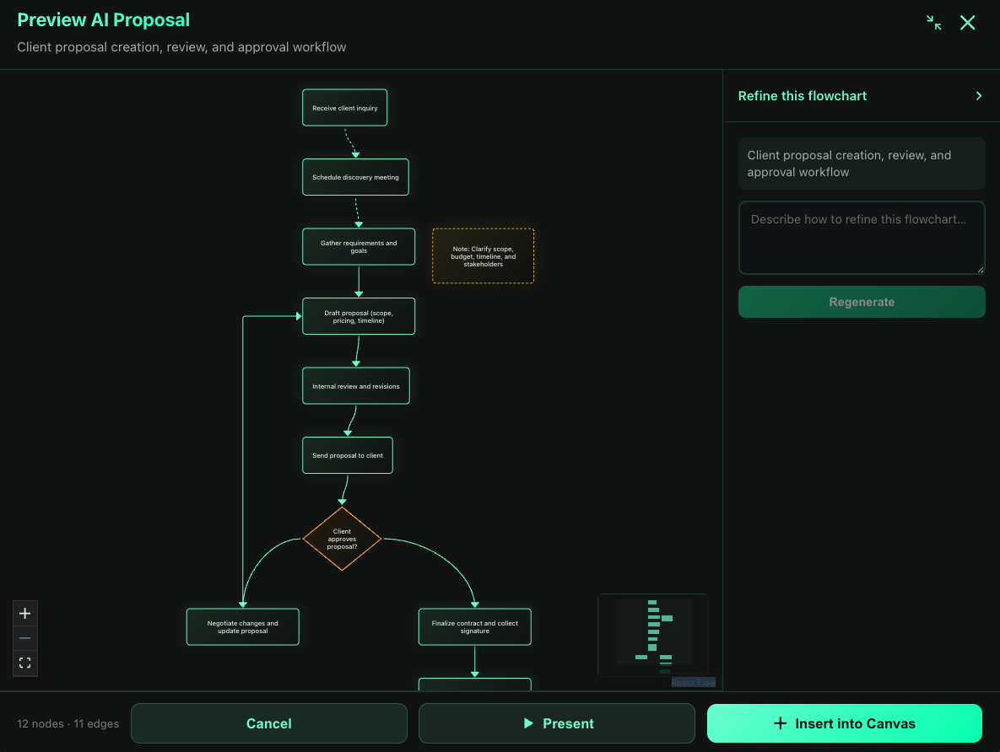
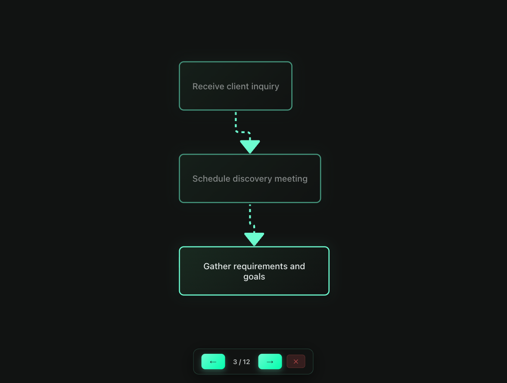
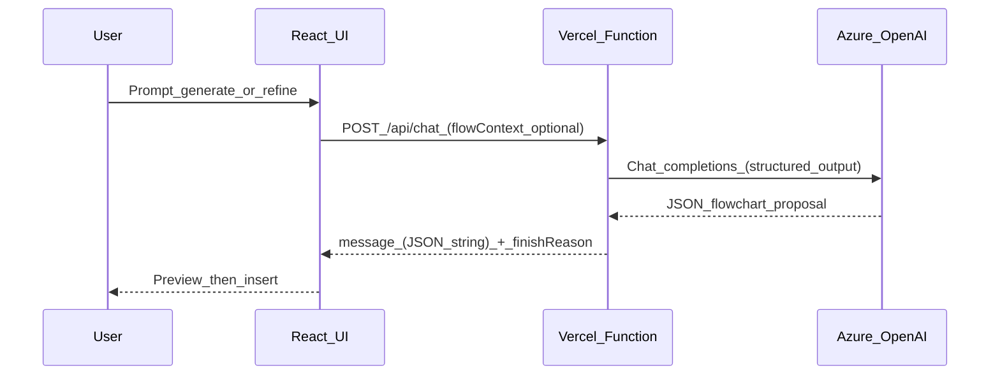

<p align="center">
  <a href="https://github.com/tmcfarlane/flowchart">
    
  </a>
</p>

<p align="center"><strong>FlowChart</strong> by <strong>ZeroClickDev</strong></p>
<p align="center">A modern flowchart designer with optional AI-assisted generation.</p>

<p align="center">
  <a href="https://github.com/tmcfarlane/flowchart/blob/main/LICENSE"></a>
  <a href="https://github.com/tmcfarlane/flowchart/stargazers"></a>
  <a href="https://github.com/tmcfarlane/flowchart/issues"></a>
</p>

<p align="center">
  <a href="https://flowchart.zeroclickdev.ai/">Live demo</a> |
  <a href="/api">API</a> |
  <a href="/src">UI</a>
</p>

---

## What is this?

FlowChart is a single-page web app for building flowcharts on an interactive canvas. It supports custom node types (step, decision, note, image), rich edge styling, presentation mode, and an optional AI assistant that can generate or refine diagrams via Azure OpenAI.
It’s styled to match the ZeroClickDev design system (dark-first charcoal UI with teal/cyan accents). 

## Screenshots

### ZeroClickDev “vibes”

Tell Flowchart what you want to make and watch it magically jump start you.



### Azure icons

Default support for official [Azure icons library](https://learn.microsoft.com/en-us/azure/architecture/icons/). AI generated nodes will also include Azure Icons if applicable.



### AI proposal preview

AI proposal view to review, regenerate, and modify prior to adding your new flowchart to the canvas. This can be helpful with large complex charts, where small iterative changes are best.



### Presentation Mode

Presentation Mode will walk you through your flowchart from start to finish. This looks and feels amazing. Controlled with arrow keys, you can walk through the flowchart while talking with any audience.



## Key features

- **Polished canvas UX**: snap-to-grid, undo/redo, copy/paste, minimap, multi-select
- **Multiple node and edge types**: editable labels, reconnection, animated styles
- **Presentation mode**: step through a flowchart to present it cleanly
- **AI-assisted flowcharts (optional)**: structured JSON outputs + preview before inserting
- **Local Azure icon library**: 663+ Azure service SVGs bundled in `assets/`

## Quickstart

### Prerequisites

- Node.js 18+
- pnpm (repo uses `pnpm@10.x`)

### Install

```bash
pnpm install
```

### Develop

```bash
pnpm dev
```

### Test

```bash
pnpm test
```

### Build

```bash
pnpm build
pnpm preview
```

## AI setup (optional)

The AI assistant is powered by **Azure OpenAI** through a serverless proxy (`api/chat.ts`) so credentials stay server-side.

1. Copy `.env.example` to `.env` and fill in values:

```bash
cp .env.example .env
```

2. Set these variables (server-side only; do **not** use `VITE_*`):

- `AZURE_DEPLOYMENT_NAME`
- `AZURE_RESOURCE_NAME`
- `AZURE_API_KEY`

When deploying to Vercel, add the same environment variables in your Vercel project settings.

## Architecture (high level)



More detail:

- API: `api/README.md`
- AI prompt “skill”: `api/flowchart-generation-skill.md`
- Icon resolution: `src/utils/azureIconRegistry.ts`

## Contributing

See `CONTRIBUTING.md`.

## Security

See `SECURITY.md`.

## Contributions

This app was built 100% with AI assistance using:

- Cursor
- OpenCode
- Oh My OpenCode

This project also inspired me to build [Oh My Cursor](https://github.com/tmcfarlane/oh-my-cursor).

Oh My Cursor is a curated set of AI agent configurations for Cursor IDE. One install gives you a team of specialized agents that coordinate autonomously through Cursor's native subagent system.

No CLI wrapper. No external runtime. Just `.cursor/agents/` files and one orchestrator rule that turns Cursor into a multi-agent IDE.

## License

MIT. See `LICENSE`.
