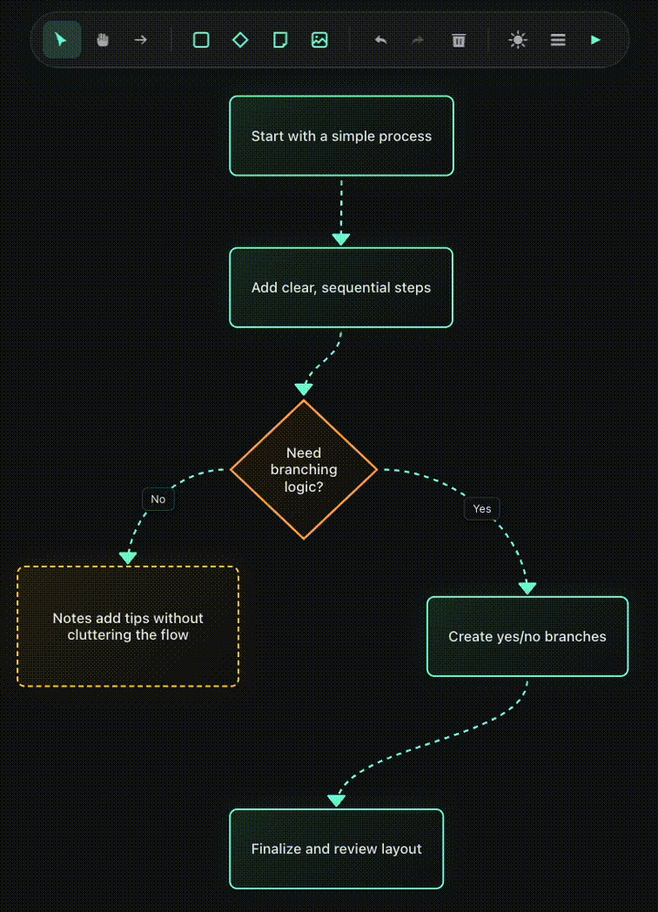
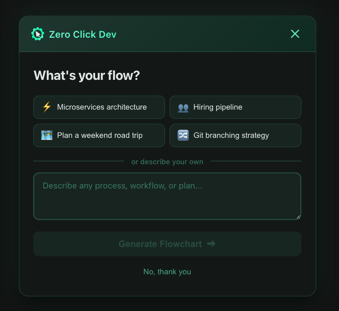
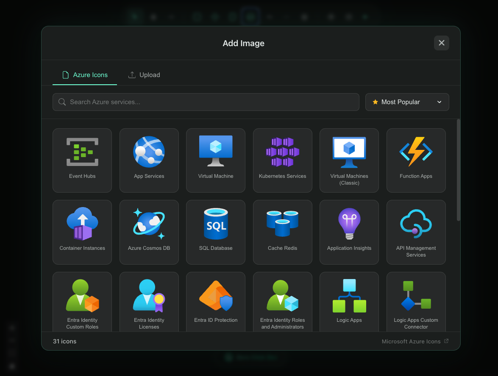
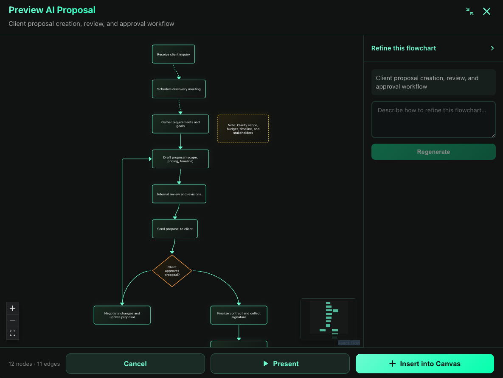
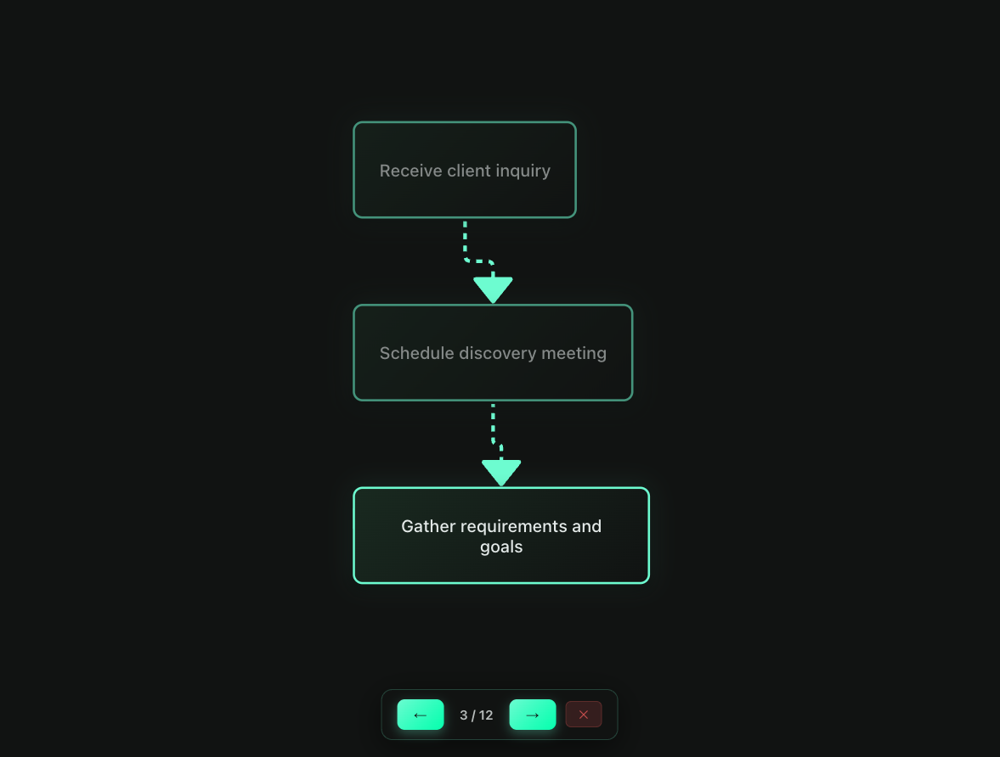
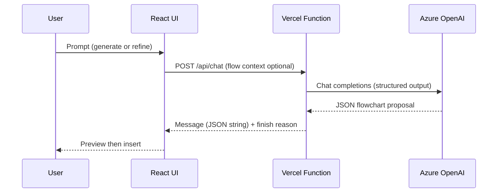

<div align="center">

<p>
  <a href="https://flowchart.zeroclickdev.ai/">
    
  </a>
</p>

<div style="font-size: 2.5em; font-weight: 800; letter-spacing: 0.08em; line-height: 1.1;">
  <strong>FLOWCHART AI</strong>
</div>

<div style="font-size: 1.1em; margin: 8px 0;">
  <strong>Describe your idea. Get a flowchart.</strong>
</div>

The open-source flowchart designer that turns plain-English prompts into polished diagrams in seconds.<br>
AI generation &nbsp;|&nbsp; 663+ Azure icons &nbsp;|&nbsp; Presentation mode &nbsp;|&nbsp; Export to PNG, SVG & GIF

<br>

[](https://flowchart.zeroclickdev.ai/)

[](LICENSE)
[](https://github.com/tmcfarlane/flowchart/stargazers)
[](https://github.com/tmcfarlane/flowchart/issues)
[](https://flowchart.zeroclickdev.ai/)
<br>

Created by <a href="https://zeroclickdev.ai/">ZeroClickDev</a>

</div>

---

## Features

- **AI-powered generation** — describe what you want in plain English, get a structured flowchart in seconds
- **Free to use** — no sign-up, no paywall, no limits on the canvas
- **Export to PNG, SVG & animated GIF** — share diagrams in docs, slides, or README files
- **Presentation mode** — step through your flowchart with arrow keys, perfect for walkthroughs
- **663+ Azure icons** — official [Azure icon library](https://learn.microsoft.com/en-us/azure/architecture/icons/) built in, auto-applied by AI
- **Dark mode** — charcoal UI with teal/cyan accents, toggleable in one click
- **Polished canvas UX** — snap-to-grid, undo/redo, copy/paste, minimap, multi-select
- **Multiple node & edge types** — step, decision, note, image nodes with editable labels and animated edges
- **AI proposal preview** — review, regenerate, and tweak AI suggestions before inserting
- **Deploy anywhere** — one-click Vercel deploy, serverless API keeps credentials safe

<details>
<summary><strong>Screenshots</strong></summary>

### AI Generation

Tell Flowchart what you want to make and watch it magically jump start you.



### Azure Icons

Official Azure icons are automatically applied to AI-generated nodes.



### AI Proposal Preview

Review, regenerate, and modify AI suggestions before adding them to the canvas.



### Presentation Mode

Walk through your flowchart step by step with arrow keys — great for meetings and demos.



</details>

## Quickstart

```bash
# Prerequisites: Node.js 18+, pnpm 10.x
pnpm install
pnpm dev          # http://localhost:3004
pnpm test         # run tests
pnpm build        # production build
```

## AI Setup (optional)

The AI assistant uses **Azure OpenAI** through a serverless proxy (`api/chat.ts`) so credentials stay server-side.

```bash
cp .env.example .env
```

Set these variables (server-side only; do **not** use `VITE_*`):

| Variable                | Description                  |
| ----------------------- | ---------------------------- |
| `AZURE_DEPLOYMENT_NAME` | Your Azure OpenAI deployment |
| `AZURE_RESOURCE_NAME`   | Your Azure resource name     |
| `AZURE_API_KEY`         | Your Azure API key           |

For Vercel, add the same variables in your project settings.

<details>
<summary><strong>Architecture</strong></summary>


```mermaid
sequenceDiagram
  participant User
  participant UI as React UI
  participant API as Vercel Function
  participant Azure as Azure OpenAI

  User->>UI: Prompt (generate or refine)
  UI->>API: POST /api/chat (flow context optional)
  API->>Azure: Chat completions (structured output)
  Azure-->>API: JSON flowchart proposal
  API-->>UI: Message (JSON string) + finish reason
  UI-->>User: Preview then insert
```

- API: [`api/`](api/README.md)
- AI prompt skill: [`api/flowchart-generation-skill.md`](api/flowchart-generation-skill.md)
- Icon resolution: [`src/utils/azureIconRegistry.ts`](src/utils/azureIconRegistry.ts)

</details>

## Tech Stack


## Contributing

See [`CONTRIBUTING.md`](CONTRIBUTING.md) and [`SECURITY.md`](SECURITY.md).

## Built With

This app was built 100% with AI assistance using Cursor, OpenCode, and [Oh My Cursor](https://github.com/tmcfarlane/oh-my-cursor).

## License

MIT. See [`LICENSE`](LICENSE).
