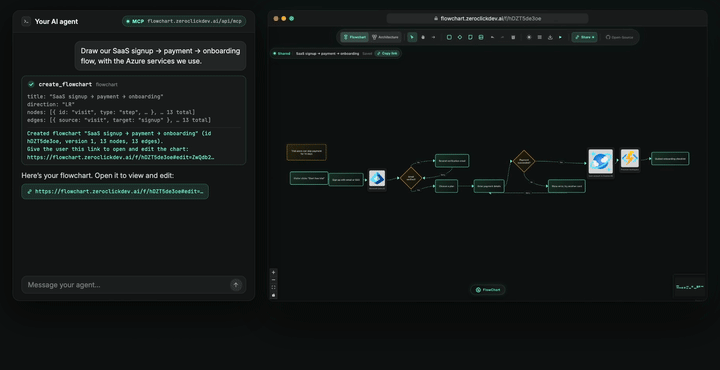
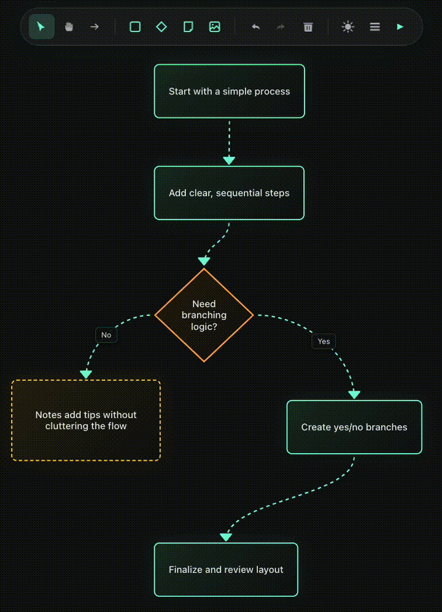
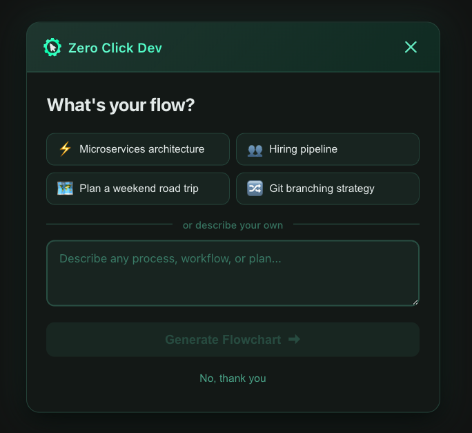
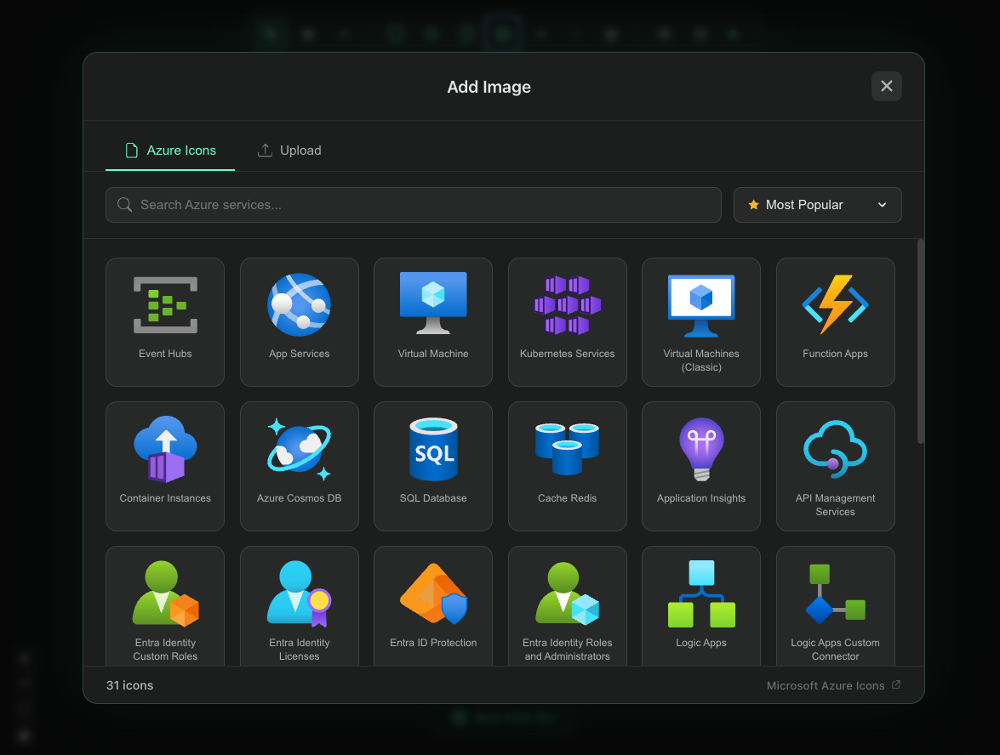
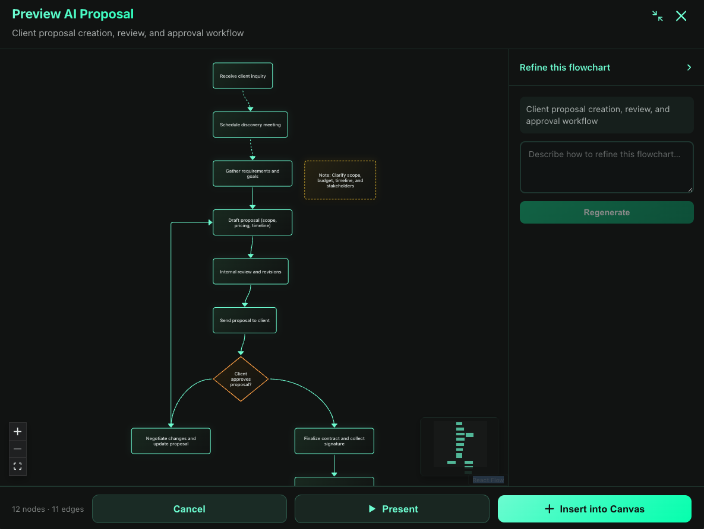
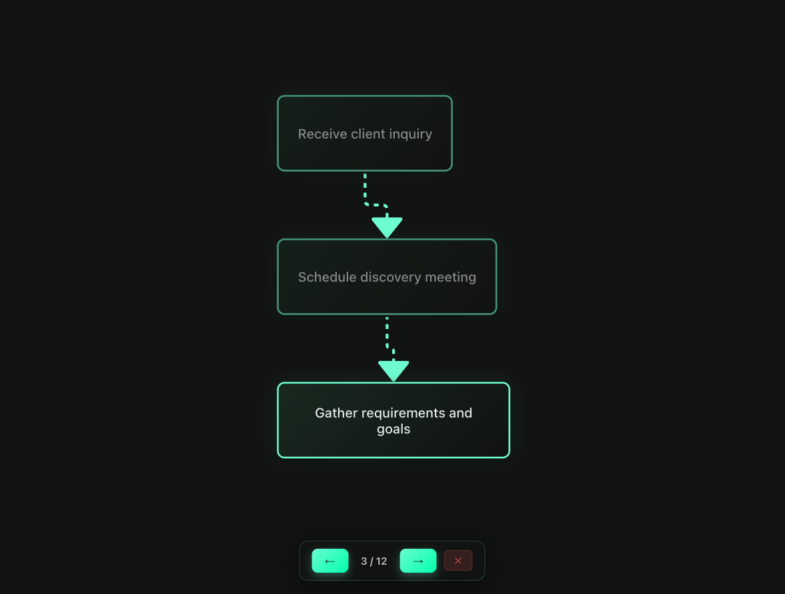
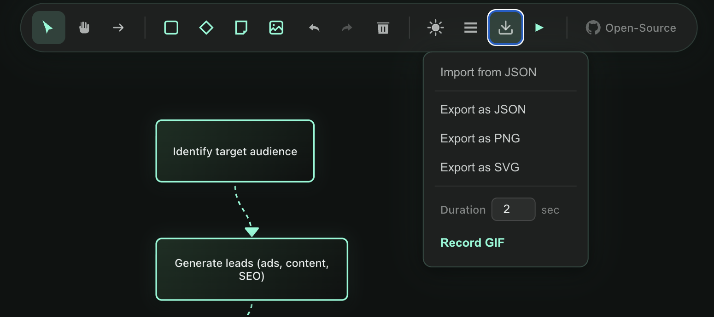
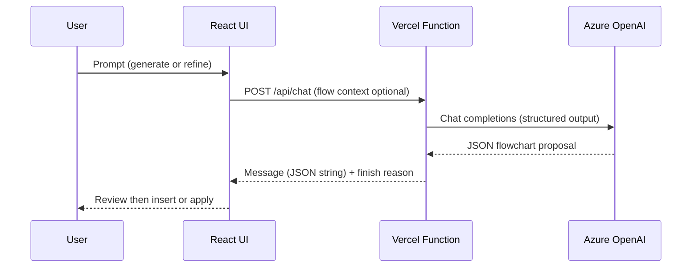

<div align="center">

<p>
  <a href="https://flowchart.zeroclickdev.ai/mcp#trailer">
    
  </a>
</p>

<p>
  <a href="https://flowchart.zeroclickdev.ai/mcp#trailer"><strong>▶ Watch the trailer</strong></a> (0:56, sound on)
</p>

<div style="font-size: 2.5em; font-weight: 800; letter-spacing: 0.08em; line-height: 1.1;">
  <strong>FLOWCHART AI</strong>
</div>

<div style="font-size: 1.1em; margin: 8px 0;">
  <strong>Describe your idea. Get a flowchart.</strong>
</div>

The open-source flowchart designer that turns plain-English prompts into polished diagrams in seconds.<br>
Diagram chat &nbsp;|&nbsp; 20 templates &nbsp;|&nbsp; 65 original illustrations + Azure icons &nbsp;|&nbsp; PNG, SVG & GIF export

<br>

[](https://flowchart.zeroclickdev.ai/)

[](LICENSE)
[](https://github.com/tmcfarlane/flowchart/stargazers)
[](https://github.com/tmcfarlane/flowchart/issues)
[](https://flowchart.zeroclickdev.ai/)
<br>

Created by <a href="https://zeroclickdev.ai/">ZeroClickDev</a>

</div>

> [!TIP]
> **New: the Flowchart AI MCP server.** Connect Claude, ChatGPT, VS Code, Cursor or OpenCode to `https://flowchart.zeroclickdev.ai/api/mcp`, and your agent can draw a flowchart, hand you a link, and create revised copies. Free, no account or API key. [Launch page and setup](https://flowchart.zeroclickdev.ai/mcp) · [Docs](docs/mcp.md)

---

## Features

- **Diagram chat** — generate a new diagram or edit the current graph; review every proposal before inserting or applying it
- **Template gallery** — 20 process, business, architecture and imaginative starting points, arranged locally without an AI request; star favorites to find them again in the same browser
- **Original illustrations** — 65 local SVG icons alongside the Azure library, with stable IDs that survive export and sharing
- **Workspace tools** — find nodes and actions with Cmd/Ctrl K, align selected siblings or distribute equal gaps, arrange diagrams, inspect graph issues, and recover reviewed browser drafts after a refresh
- **Premium image studio** — optional Stripe subscriptions, verified paid access, bounded image generation and explicit request recovery after a refresh; requires operator configuration
- **Works with your AI agent (MCP)** — Claude, Copilot, Cursor, OpenCode or ChatGPT can create a chart, hand you a link, and create revised copies
- **Share links with live sync** — private edit links save browser changes; view links can become editable local copies after reviewing any earlier browser draft
- **Free canvas and templates** — create and edit diagrams without an account; configured AI endpoints enforce capacity limits
- **Export to PNG, SVG & animated GIF** — capture the entire diagram or the current view, with clean artwork and progress that stays visible during capture
- **Presentation mode** — step through your flowchart with arrow keys, perfect for walkthroughs
- **633 Azure icons** — official [Azure icon library](https://learn.microsoft.com/en-us/azure/architecture/icons/) built in, auto-applied by AI
- **Dark and light workspaces** — violet/teal accents or warm ivory, with layouts for desktop and mobile
- **Polished canvas UX** — snap-to-grid, undo/redo, copy/paste, minimap, multi-select
- **Mixed diagrams** — flowchart shapes, six architecture shapes, image nodes and nested containers; label connections with protocols and synchronous/asynchronous styles
- **AI proposal preview** — review, regenerate, and tweak AI suggestions before inserting
- **Deploy anywhere** — one-click Vercel deploy, serverless API keeps credentials safe

<details>
<summary><strong>Screenshots</strong></summary>

### Demo



### AI Generation

Tell Flowchart what you want to make and watch it magically jump start you.



### Azure Icons

Official Azure icons are automatically applied to AI-generated nodes.



### AI Proposal Preview

Review, regenerate, and modify AI suggestions before adding them to the canvas.



### Presentation Mode

Walk through your flowchart step by step with arrow keys — great for meetings and demos.



### Export & Save

Export to PNG, SVG, animated GIF, or JSON. Image exports default to the entire diagram, including off-screen nodes and nested containers; choose Current view to retain the canvas crop. JSON always keeps the full graph. Import JSON to pick up where you left off. See [image export behavior](docs/image-export.md) for capture limits and recovery from export errors.



</details>

## Quickstart

```bash
# Prerequisites: Node.js 20+
npm install
npm run dev       # http://localhost:3004
npm test          # run tests
npm run build     # frontend/API typechecks and production build
```

For the two compiled-website local-copy recovery checks, see [browser regression setup and evidence](docs/browser-tests.md).

## Use it from your AI agent (MCP)

Flowchart AI is also a remote MCP server. Connect it to your agent, ask for a chart, and you get a link to an editable flowchart. Use the private MCP Apps card to edit in the browser. Conversational revisions read the latest chart and create a new copy, preserving the original.

```
https://flowchart.zeroclickdev.ai/api/mcp
```

```sh
# Claude Code
claude mcp add --transport http flowchart https://flowchart.zeroclickdev.ai/api/mcp
```

MCP v2 creates link-shared charts and revised copies. Private MCP Apps controls provide an SVG preview, zoom, browser editing and confirmed deletion without exposing edit tokens to the model. See [plugin implementation and review requirements](docs/chatgpt-plugin.md). Its eight tools are `create_flowchart`, `get_flowchart`, `list_node_types`, `search_azure_icons`, `search_icons`, `list_diagram_templates`, `get_diagram_template` and `audit_diagram`. No account or API key is needed for these deterministic tools. The dev server serves the MCP endpoint at `http://localhost:3004/api/mcp`. The **[launch page](https://flowchart.zeroclickdev.ai/mcp)** and **[MCP docs](docs/mcp.md)** cover setup, privacy and self-hosting.

The existing browser editor retains live sync and version checks; conversational writes create separate copies in MCP v2.

## AI Setup (optional)

The AI assistant uses **Azure OpenAI** through a serverless proxy (`api/chat.ts`) so credentials stay server-side.

```bash
cp .env.example .env
```

Set these variables (server-side only; do **not** use `VITE_*`):

| Variable                | Description                  |
| ----------------------- | ---------------------------- |
| `AZURE_DEPLOYMENT_NAME` | Your Azure OpenAI deployment |
| `AZURE_RESOURCE_NAME`   | Your Azure resource name     |
| `AZURE_API_KEY`         | Your Azure API key           |

For Vercel, add the same variables in your project settings and configure the shared Redis capacity store and website origin described in [diagram AI](docs/diagramAI.md).

Website chat currently uses the operator's Azure deployment. Using each user's own ChatGPT AI allowance requires separate plan-usage consent and approved hosted application configuration; it is not enabled here. The current ChatGPT plan-usage preview excludes image generation. See [ChatGPT plan usage](docs/chatgpt-plan-usage.md).

The website account control supports [ChatGPT identity sign-in](docs/chatgpt-sign-in.md) when an approved hosted OAuth client is configured. Without that configuration it explicitly reports unavailability. Signed mock-provider tests verify the implementation; live OpenAI sign-in remains unverified.

To configure paid image generation, follow [Premium setup](docs/premium.md). Checkout uses Stripe-hosted pages; paid access comes from verified payment state, and image requests use a separately configured OpenAI Images API project. The studio reports missing configuration instead of granting paid access or inventing output.

<details>
<summary><strong>Architecture</strong></summary>


```mermaid
sequenceDiagram
  participant User
  participant UI as React UI
  participant API as Vercel Function
  participant Azure as Azure OpenAI

  User->>UI: Prompt (generate or refine)
  UI->>API: POST /api/chat (flow context optional)
  API->>Azure: Chat completions (structured output)
  Azure-->>API: JSON flowchart proposal
  API-->>UI: Message (JSON string) + finish reason
  UI-->>User: Review then insert or apply
```

- API: [`api/`](api/README.md)
- AI request contract and capacity controls: [`docs/diagramAI.md`](docs/diagramAI.md)
- Icon resolution: [`src/utils/azureIconRegistry.ts`](src/utils/azureIconRegistry.ts)

</details>

## Tech Stack


## Contributing

See [`CONTRIBUTING.md`](CONTRIBUTING.md) and [`SECURITY.md`](SECURITY.md).

## Built With

This app was built 100% with AI assistance using Cursor, OpenCode, and [Oh My Cursor](https://github.com/tmcfarlane/oh-my-cursor).

## License

MIT. See [`LICENSE`](LICENSE).
