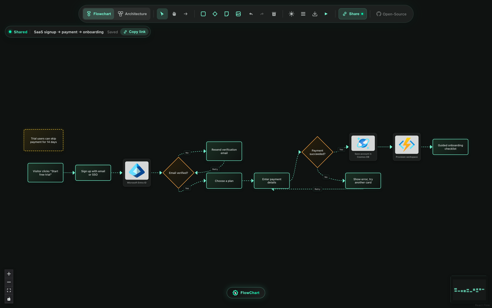
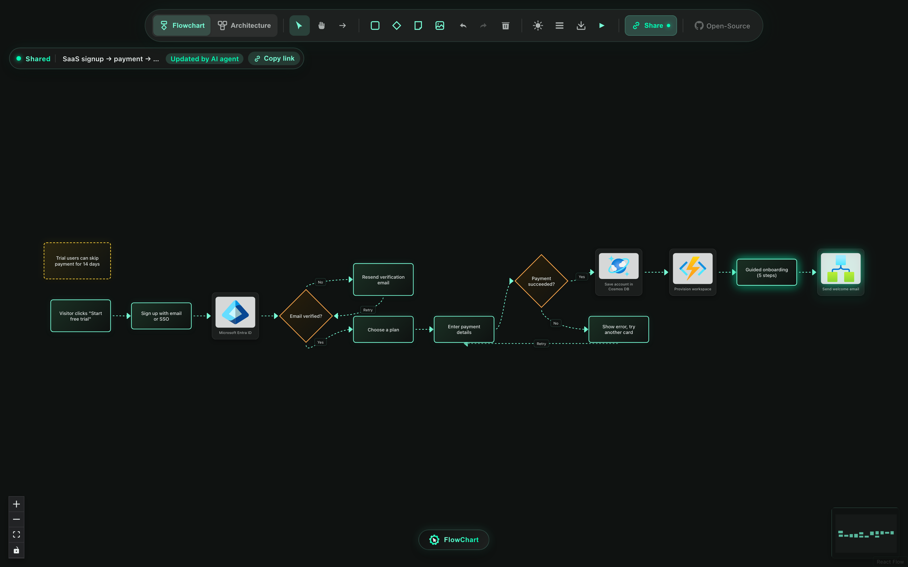
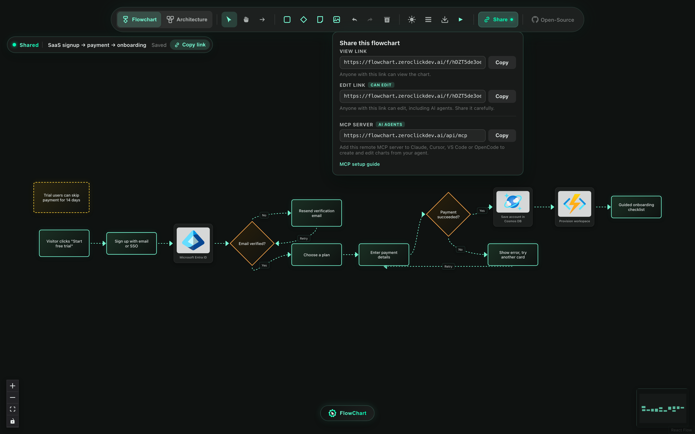

# Flowchart AI MCP server

Let any AI agent draw a flowchart, hand you a link, and keep editing the same chart with you.

```
https://flowchart.zeroclickdev.ai/api/mcp
```

The Flowchart AI MCP server is a remote [Model Context Protocol](https://modelcontextprotocol.io) server. Your agent (Claude, Copilot in VS Code, Cursor, OpenCode, ChatGPT, and others) designs the chart. The server validates it, lays it out, stores it, and returns a link that opens in the Flowchart AI editor. You can drag, relabel, or extend the chart in the browser; the agent reads your changes before its next edit, and its edits appear live in your open tab.

- **No account and no API key.** Access to each chart is controlled by its link (see [Privacy](#privacy-and-security)).
- **No LLM calls on the server.** Your own agent does the thinking; the server only validates, lays out, and stores.
- **Streamable HTTP, stateless.** Any MCP client that supports remote servers can connect.



## Connect your agent

The same steps, with copy buttons, are on the [launch page](https://flowchart.zeroclickdev.ai/mcp#setup).

### Claude Code

```sh
claude mcp add --transport http flowchart https://flowchart.zeroclickdev.ai/api/mcp
```

Add `--scope user` to make it available in all your projects. Run `/mcp` in Claude Code to check the connection.

### Claude (desktop and web)

Open **Customize → Connectors** ([claude.ai/customize/connectors](https://claude.ai/customize/connectors)), click **+**, then **Add custom connector**. Name it "Flowchart AI", paste `https://flowchart.zeroclickdev.ai/api/mcp` as the URL, leave **Advanced settings** (OAuth client ID and secret) empty, and click **Add**. Turn it on in a chat from **+ → Connectors**. Custom connectors work on the Free plan (one custom connector), Pro and Max. On Team and Enterprise plans, an Owner first adds the connector under **Organization settings → Connectors** (**Add → Custom → Web**); members then connect it from **Customize → Connectors**.

### VS Code (GitHub Copilot agent mode)

Run **MCP: Add Server** from the Command Palette, choose HTTP, paste the server URL, and save it to **.mcp.json** (this workspace) or **Copilot Global** (every workspace). Or add it to `.mcp.json` at the root of your workspace (the portable format VS Code now recommends; Claude Code reads the same file):

```json
{
  "mcpServers": {
    "flowchart": {
      "type": "http",
      "url": "https://flowchart.zeroclickdev.ai/api/mcp"
    }
  }
}
```

Or add it to your VS Code user profile from a terminal:

```sh
code --add-mcp '{"name":"flowchart","type":"http","url":"https://flowchart.zeroclickdev.ai/api/mcp"}'
```

The older `.vscode/mcp.json` file (a top-level `servers` object) still works, but VS Code lists it as deprecated.

### Cursor

Add the server to `~/.cursor/mcp.json` (all projects) or `.cursor/mcp.json` (one project):

```json
{
  "mcpServers": {
    "flowchart": {
      "url": "https://flowchart.zeroclickdev.ai/api/mcp"
    }
  }
}
```

### OpenCode

```sh
opencode mcp add flowchart --url https://flowchart.zeroclickdev.ai/api/mcp
```

Add `--global` to use it in every project. Or add it to `opencode.json` yourself:

```json
{
  "$schema": "https://opencode.ai/config.json",
  "mcp": {
    "servers": {
      "flowchart": {
        "type": "remote",
        "url": "https://flowchart.zeroclickdev.ai/api/mcp"
      }
    }
  }
}
```

That is the OpenCode 2 format. OpenCode 1.x has no `servers` level: put `"flowchart": { "type": "remote", "url": "https://flowchart.zeroclickdev.ai/api/mcp" }` directly under `"mcp"`, or run `opencode mcp add` and follow the prompts.

### ChatGPT

In ChatGPT on the web, open **Settings → Security and login** and turn on **Developer mode**. Then go to [chatgpt.com/plugins](https://chatgpt.com/plugins), click **+**, name it "Flowchart AI", enter `https://flowchart.zeroclickdev.ai/api/mcp` as the connection URL with **No authentication**, and create it. In a chat, choose **Developer mode** from the **+** menu and select the app; ChatGPT asks you to confirm write actions such as `create_flowchart`. Developer mode is available to Plus, Pro, Business, Enterprise and Edu accounts; in a workspace, an admin may need to allow it. Menu names change often; look for "developer mode" if they differ.

### Other clients and quick checks

Any client that supports the Streamable HTTP transport works with the URL above. To poke at the server from a terminal, use the MCP Inspector:

```sh
npx @modelcontextprotocol/inspector --cli https://flowchart.zeroclickdev.ai/api/mcp --transport http --method tools/list
```

## How it works

1. You ask your agent for a chart: "Draw our SaaS signup → payment → onboarding flow."
2. The agent calls `create_flowchart` with nodes and edges. It usually leaves positions out, so the server lays the chart out.
3. The agent gives you the **edit link** (`https://flowchart.zeroclickdev.ai/f/<id>#edit=<token>`). Open it to see the chart in the editor.
4. Change anything in the browser. Edits save automatically; the badge in the top-left corner shows **Saved**.
5. Ask the agent for changes ("add a welcome email after onboarding"). It calls `get_flowchart` to load your latest version, then `update_flowchart` with small operations. Your open tab updates within a few seconds, highlights the changed nodes, and shows **Updated by AI agent**.

If the agent works from an out-of-date version, the server rejects the edit instead of overwriting your work, and the agent reloads and retries. If the agent changes the chart while you have unsaved edits in the browser, the app asks whether to load the latest version or keep yours. It never silently discards either.



You can also start in the browser: build a chart by hand, click **Share → Create share link**, and give the edit link to your agent. The Share panel lists the view link, the edit link, and this MCP server's URL.



## Tools

### `create_flowchart`

Creates a chart and returns its links.

| Argument | Type | Notes |
| --- | --- | --- |
| `title` | string | Up to 200 characters. |
| `nodes` | array | 1 to 500 [nodes](#nodes). Omit positions for automatic layout. |
| `edges` | array | Up to 1,000 [edges](#edges). |
| `direction` | `"TB"` \| `"LR"` | Layout direction. The default is `TB` (top to bottom); `LR` suits architecture diagrams and wide screens. |

Returns `id`, `version`, `title`, `url` (view link), `editUrl` (edit link), `editToken`, `nodeCount`, `edgeCount`, and `layout`. The text result tells the agent to give the user the edit link and to call `get_flowchart` before editing later.

### `get_flowchart`

Returns the current chart: `id`, `version`, `title`, `nodes` (with positions and sizes), `edges`, `createdAt`, `updatedAt`, `updatedVia` (`mcp` or `api`, where `api` usually means the browser), and `url`. It accepts a chart id or any chart URL. Read-only.

### `update_flowchart`

Changes an existing chart. Requires `id` and `editToken`; the full edit link is also accepted in place of the token.

| Argument | Notes |
| --- | --- |
| `operations` | Preferred. Applied in order, all or nothing: `add_node`, `update_node`, `remove_node` (also removes its edges; children of a removed container stay on the canvas), `add_edge`, `update_edge`, `remove_edge`. In `changes`, `null` clears an optional field. |
| `replace` | `{ nodes, edges }` rebuilds the whole chart. Requires `expectedVersion`. |
| `expectedVersion` | The version the agent last read. If the chart has changed since, the call fails with a conflict instead of overwriting. |
| `title` | Renames the chart. |
| `relayout` | Re-lays out the whole chart. Otherwise, new nodes without positions are placed next to the nodes they connect to, and the rest of the chart stays where it is. |
| `direction` | Direction for placement and relayout. |

Returns the new `version`, links, counts, and a list of the changes applied.

### `list_node_types`

Lists node types with descriptions, default sizes, and icon support, plus container kinds, edge styles, handles, protocols, and limits. Read-only.

### `search_azure_icons`

Searches the 633 official Azure service icons by name, abbreviation, or alias ("cosmos", "aks", "key vault", "functions"). Returns icon ids for the `icon` field. Read-only.

### Resources and prompt

| Name | Kind | Contents |
| --- | --- | --- |
| `flowchart://guide` | Resource (Markdown) | The authoring guide: workflow, design rules, node types, icons, containers, layout, editing, and full examples. |
| `flowchart://schema` | Resource (JSON) | JSON Schemas for nodes, edges, and operations, plus the vocabulary and limits. |
| `design_flowchart` | Prompt | Arguments `topic` and optional `kind` (`flowchart` or `architecture`). Asks the agent to design, create, and share a chart. |

## Chart format

### Nodes

| Field | Required | Notes |
| --- | --- | --- |
| `id` | Yes | Unique within the chart, for example `"signup"`. |
| `type` | Yes | `step`, `decision`, `note`, `image`, `service`, `database`, `queue`, `cache`, `apiGateway`, `externalActor`, or `container`. |
| `label` | Yes | Short text; up to 500 characters. |
| `position` | No | `{ x, y }`, the top-left corner in pixels. Relative to the container for nested nodes. |
| `width`, `height` | No | By default the server sizes nodes to fit their labels. |
| `icon` | No | Azure icon id from `search_azure_icons`. Shown by `image` nodes (large) and architecture nodes (small glyph). |
| `imageUrl` | No | An `https://` image for `image` nodes when no Azure icon fits. |
| `parentNode` | No | Id of a `container` node to place this node inside. |
| `containerKind` | No | Containers only: `group`, `vpc`, `cluster`, `region`, `zone`, or `trustBoundary`. |

### Edges

| Field | Required | Notes |
| --- | --- | --- |
| `source`, `target` | Yes | Node ids. |
| `id` | No | Generated as `e<source>-<target>` when omitted. |
| `label` | No | For example `"Yes"` or `"No"` on edges leaving a decision. |
| `style` | No | `animated` (dashed, flowing; the default), `default` (solid curve), or `step` (right angles). |
| `sourceHandle`, `targetHandle` | No | `top`, `right`, `bottom`, or `left`. Chosen from the layout when omitted. |
| `protocol` | No | `HTTPS`, `gRPC`, `REST`, `SQL`, `WebSocket`, or `event`. |
| `commStyle` | No | `sync` (solid) or `async` (dashed). |

Invalid input comes back as a tool error (`isError: true`) that lists every problem with its location and a fix, for example:

```text
create_flowchart failed: The chart has 2 problems. Fix all of them and call create_flowchart again.
- nodes[2].icon: unknown Azure icon "cosmoss". Did you mean "azure-cosmos-db" (Azure Cosmos DB)? Use search_azure_icons to find valid icon ids.
- edges[4].target: no node with id "pymnt". Did you mean "pay"? Existing node ids: "visit", "signup", "pay", "done".
```

## Example session

> **You:** Draw our SaaS signup → payment → onboarding flow, with the Azure services we use.
>
> **Agent** calls `search_azure_icons` for "entra id" and "cosmos", then `create_flowchart`:
>
> ```json
> {
>   "title": "SaaS signup → payment → onboarding",
>   "direction": "LR",
>   "nodes": [
>     { "id": "visit", "type": "step", "label": "Visitor clicks \"Start free trial\"" },
>     { "id": "auth", "type": "image", "label": "Microsoft Entra ID", "icon": "microsoft-entra-id" },
>     { "id": "verified", "type": "decision", "label": "Email verified?" },
>     { "id": "pay", "type": "step", "label": "Enter payment details" },
>     { "id": "paid", "type": "decision", "label": "Payment succeeded?" },
>     { "id": "db", "type": "image", "label": "Save account in Cosmos DB", "icon": "azure-cosmos-db" },
>     { "id": "onboard", "type": "step", "label": "Guided onboarding checklist" }
>   ],
>   "edges": [
>     { "source": "visit", "target": "auth" },
>     { "source": "auth", "target": "verified" },
>     { "source": "verified", "target": "pay", "label": "Yes" },
>     { "source": "pay", "target": "paid" },
>     { "source": "paid", "target": "pay", "label": "No" },
>     { "source": "paid", "target": "db", "label": "Yes" },
>     { "source": "db", "target": "onboard" }
>   ]
> }
> ```
>
> **Agent:** Here's your flowchart: https://flowchart.zeroclickdev.ai/f/Ab3dE5fG7h#edit=… You can edit it in the browser; I'll pick up your changes.
>
> *You rename "Enter payment details" to "Enter card or PayPal" in the browser.*
>
> **You:** Add a welcome email after onboarding.
>
> **Agent** calls `get_flowchart` (version 2, which includes your rename), then `update_flowchart`:
>
> ```json
> {
>   "id": "Ab3dE5fG7h",
>   "editToken": "…",
>   "expectedVersion": 2,
>   "operations": [
>     { "op": "add_node", "node": { "id": "welcome", "type": "image", "label": "Send welcome email", "icon": "logic-apps" } },
>     { "op": "add_edge", "edge": { "source": "onboard", "target": "welcome" } }
>   ]
> }
> ```
>
> *Your open tab shows the new node within a few seconds.*

## Privacy and security

- **Anyone with the view link can see the chart.** Chart ids are random (10 characters, about 59 bits), so links can't practically be guessed, but they aren't secret once shared. Don't put passwords, keys, or other secrets in charts.
- **The edit link grants edit access.** It carries a 256-bit edit token after `#edit=`. Browsers don't send the part after `#` to servers, so it stays out of server logs. The server stores only a SHA-256 hash of the token and compares hashes in constant time. When you open an edit link, the app saves the token in your browser's local storage for that chart and removes it from the address bar.
- **Your agent sees the token.** It needs it to edit. Share the edit link only with people and agents you trust to change the chart; share the view link with everyone else.
- **Edit tokens stay out of analytics.** The site uses Vercel Web Analytics, which records page URLs; the app strips the `#edit=` part from every analytics event, including the first page view that can fire before the token leaves the address bar.
- **Images in a chart load from wherever they point.** An `image` node's `imageUrl` can be any `https://` address, so opening a chart makes your browser fetch those images, which tells the image host your IP address, like any web page with images. Images render as plain `` elements (no scripts), and the server refuses addresses that aren't `https://`, `data:image/`, or same-site paths.
- **There are no accounts, and charts can't be deleted yet.** To remove a chart's content, clear the canvas while it's shared; the empty chart is saved.
- **Charts are kept indefinitely** unless the operator sets a retention period (`FLOW_TTL_DAYS`).

## Free to use

Flowchart AI's MCP server and sharing are free. There is no account, sign-up, API key, or OAuth: the endpoint accepts requests from anyone who has its URL, and each chart is protected only by its links. The server never calls an LLM, so what it spends per request is small (storage reads and writes, and CPU for automatic layout).

To keep it free for everyone, requests are rate-limited:

- **Per network (IP address)**, so one script can't hog the service. Agents that run in the cloud, such as Claude on the web and ChatGPT, reach MCP servers from their provider's shared IP addresses, so the per-IP limits for MCP tools are much higher than for the browser.
- **By shared daily budgets** for new charts, chart updates, and new storage across all users, so the service can't be run up to large bills or out of its hosting quotas. Budgets reset at 00:00 UTC.

A refused request says which limit applied and when to retry: MCP tools return an error result (`isError: true`), and the REST API returns `429` with a `Retry-After` header. The browser slows its checks and saves down automatically.

## Limits

| Limit | Value |
| --- | --- |
| Nodes per chart | 500 |
| Edges per chart | 1,000 |
| Operations per `update_flowchart` call | 200 |
| Label / title length | 500 / 200 characters |
| Request body and stored chart size | 256 KB |

Rate limits (defaults; operators can change them, see [Self-hosting](#self-hosting)):

| Scope | Limit |
| --- | --- |
| `create_flowchart` per IP address | 300 per hour |
| `update_flowchart` per IP address | 1,200 per hour |
| Chart creations from the browser or REST API, per IP address | 30 per 10 minutes |
| Updates from the browser or REST API, per IP address | 120 per minute |
| Chart reads, per IP address | 600 per minute |
| Update checks (`?since=`), per IP address | 1,200 per minute |
| MCP messages (each JSON-RPC message, including `initialize` and `tools/list`), per IP address | 1,200 per minute |
| New charts, all users together | 5,000 per day |
| Chart updates, all users together | 50,000 per day |
| Growth of stored charts, all users together | 50 MB per day |

Creations and updates are counted in work units: one per request, plus more when the server has to lay out a large chart automatically (about 5 for 100 nodes, 29 for 200, 178 for 500 nodes and 1,000 edges), because that layout takes up to a few seconds of CPU. Charts you position yourself, and all saves from the browser, cost one unit. Reads, update checks, and MCP messages are counted separately on each server instance.

## REST API

The browser uses a small REST API, and other integrations can use it too:

| Request | Purpose |
| --- | --- |
| `POST /api/flows` | Create a chart from `{ title?, nodes, edges?, direction? }`. Returns `{ id, version, url, editUrl, editToken, chart }`. |
| `GET /api/flows/:id` | Read a chart. Add `?since=<version>` for a cheap check: it returns `{ changed: false }` while nothing is newer. |
| `PUT /api/flows/:id` | Replace the chart. Send `Authorization: Bearer <editToken>` and `baseVersion` to avoid overwriting newer changes (`409` on conflict). |
| `PATCH /api/flows/:id` | Apply `{ operations, baseVersion? }`, the same operations as `update_flowchart`. |

Errors use standard status codes (`400` with an `issues` list, `401`/`403` for a missing or wrong token, `404`, `409` with `currentVersion`, `413`, `429` with `Retry-After` and `{ code: "rate_limited", scope: "ip" | "global", retryAfterSeconds }`, and `503` when storage isn't configured or is temporarily unavailable).

## Self-hosting

Flowchart AI deploys to Vercel as a Vite app with Node functions in `api/`. The MCP server needs storage for charts:

1. In your Vercel project, open **Storage**, choose **Upstash for Redis** from the Marketplace, create a database, and connect it to the project. This sets `KV_REST_API_URL` and `KV_REST_API_TOKEN`.
2. Redeploy. The function logs show `[flowchart] Storage: Upstash Redis (...)`.

If storage isn't configured, production deployments return `503` for chart operations and log what to set, rather than keeping charts in memory and losing them.

| Variable | Purpose |
| --- | --- |
| `KV_REST_API_URL`, `KV_REST_API_TOKEN` | Upstash Redis REST credentials (set by the Vercel Marketplace integration). |
| `UPSTASH_REDIS_REST_URL`, `UPSTASH_REDIS_REST_TOKEN` | Alternative names from the Upstash console. Either pair works. |
| `PUBLIC_BASE_URL` | Origin used in returned links, for example `https://flowchart.example.com`. Defaults to the request's host. |
| `FLOW_TTL_DAYS` | Optional. Delete charts after this many days without changes. Unset keeps charts indefinitely. |
| `FLOW_RATE_LIMIT` | Optional. Set to `off` to disable all rate limits and budgets (for example, behind your own gateway). |
| `FLOW_LIMIT_MCP_CREATE`, `FLOW_LIMIT_MCP_WRITE` | Per-IP limits for `create_flowchart` and `update_flowchart`. Defaults `300/1h` and `1200/1h`. |
| `FLOW_LIMIT_CREATE`, `FLOW_LIMIT_WRITE` | Per-IP limits for the REST API (the browser). Defaults `30/10m` and `120/1m`. |
| `FLOW_LIMIT_READ`, `FLOW_LIMIT_POLL`, `FLOW_LIMIT_MCP` | Per-IP limits for reads, `?since=` checks, and MCP messages, counted per server instance. Defaults `600/1m`, `1200/1m`, `1200/1m`. |
| `FLOW_BUDGET_CREATES`, `FLOW_BUDGET_WRITES` | Budgets for all users together, in work units. Defaults `5000/1d` and `50000/1d`. |
| `FLOW_BUDGET_STORAGE` | Budget for the growth of stored charts, all users together. Default `50mb/1d`. |
| `FLOW_TRUST_PROXY` | Optional. Set to `1` to take client IPs from `X-Forwarded-For`/`X-Real-IP` when you run behind your own proxy. On Vercel they're always used (Vercel sets them); elsewhere they're ignored so clients can't fake them. |
| `FLOW_STORE` | Optional. Set to `memory` to allow the in-memory store in production (single long-running process only). |

Limits use the form `<count>/<window>` with a window in `s`, `m`, `h`, or `d` (for example `600/1m` or `5000/1d`; storage takes `kb`, `mb`, or `gb`), or `off`. Windows are fixed and aligned to the clock, so daily budgets reset at 00:00 UTC. Per-IP limits for creations and updates and all budgets are counted in Redis, shared by every function instance; reads, checks, and MCP messages are counted in memory per instance, which costs no Redis commands. If Redis can't be reached, requests are allowed rather than refused.

For local development, `npm run dev` serves the app, `/api/flows`, and `/api/mcp` on http://localhost:3004 using the same handler code as Vercel. Without Redis variables, charts are kept in a file under your system's temp directory so they survive dev-server restarts. Point an agent at `http://localhost:3004/api/mcp` to try it.

The implementation lives in `api/mcp.ts`, `api/flows/`, and `src/shared/` (schema, operations, layout, storage, and the MCP server). `npm test` runs the unit, MCP protocol, and HTTP tests; `npm run typecheck:api` type-checks the functions the way Vercel runs them.

## Capacity and costs

What each action costs a deployment. Redis commands are counted the way Upstash bills them: a Lua script is one command plus each command it runs.

| Action | Function invocations | Redis commands |
| --- | --- | --- |
| Open a shared chart | 1 | 1 |
| Browser update check (`?since=`) with nothing new | 1 | 1 |
| Browser update check that finds a change | 1 | 2 |
| Browser save | 1 | 7 (9 if the chart grew by more than 256 bytes) |
| Create a chart (browser or `create_flowchart`) | 1 | 8 (11 with a large automatic layout) |
| `update_flowchart` | 1 | 7 to 9 (3 more for a large relayout) |
| `get_flowchart` | 1 | 1 |
| Any other MCP message: `initialize`, `tools/list`, `search_azure_icons`, ... | 1 | 0 |

Setting `FLOW_TTL_DAYS` adds one command to each create and update. The MCP server is stateless, so every JSON-RPC message is its own HTTP request: an agent usually sends three to five (`initialize`, the initialized notification, `tools/list`, ...) before its first tool call.

**Browser checks** are the largest steady cost, so the app checks for agent edits adaptively. It checks every 3 seconds for 3 minutes after a chart opens, after a change arrives, after you edit, and when you come back to the tab (focus, showing the tab, or input after a quiet minute; these also check immediately). Otherwise it slows to one check every 15 seconds. It stops while the tab is hidden, and after 30 minutes without input or changes until you return. An open tab that nobody touches makes about 170 checks in its first 30 minutes and then none; a tab you're actively working in makes up to 20 a minute.

**Free tiers** (September 2026):

- [Upstash Redis Free](https://upstash.com/pricing/redis): 256 MB of data, 500K commands a month, 10 GB of bandwidth a month. That's roughly 400 hours of actively watched charts, or 70,000 browser saves. When the commands run out, Upstash refuses them ([`ERR max requests limit exceeded`](https://upstash.com/docs/redis/troubleshooting/max_requests_limit)) until the next month or an upgrade; the API then answers `503` and logs the Upstash error. Pay as you go costs $0.20 per 100K commands and can be capped with a monthly budget.
- [Vercel Hobby](https://vercel.com/docs/plans/hobby): 1M function invocations, 4 hours of Active CPU, 360 GB-hours of provisioned memory, 1M CDN requests, 100 GB of Fast Data Transfer, and 10 GB of Fast Origin Transfer a month, plus 50K Web Analytics events. Invocations, mostly browser checks, usually run out first: 1M is about 800 hours of actively watched charts. When a Hobby limit is exceeded, that feature stays paused until 30 days have passed, and Hobby is for non-commercial, personal use only.

**What to watch:**

- Upstash: monthly commands, data size, and bandwidth. Without `FLOW_TTL_DAYS` charts accumulate; the storage budget caps growth at 50 MB a day, so abuse alone would need about 5 days to fill a 256 MB database, and ordinary use fills it eventually. Decide on a retention period or a paid plan before that happens.
- Vercel: function invocations and Active CPU. Automatic layout usually takes 10 to 60 ms of CPU; the largest charts take seconds, which is why they cost extra work units.
- Logs: `[flowchart] Redis ... failed` (with a hint when an Upstash plan limit is the cause) and `Rate limiter unavailable`.
- Budget errors: if real use hits `FLOW_BUDGET_*`, raise them (and move off the free tiers); if abuse does, lower the per-IP limits or block the source in the Vercel Firewall.

**Settings that block agents:** MCP clients aren't browsers, so they can't pass a login or a JavaScript challenge.

- [Deployment Protection](https://vercel.com/docs/deployment-protection): Standard Protection covers preview deployments and generated `*.vercel.app` URLs but not production domains, so point agents at the production domain. "All Deployments" protection blocks agents everywhere.
- [Attack Mode](https://vercel.com/docs/vercel-firewall/attack-mode) and the [Bot Protection managed ruleset](https://vercel.com/docs/bot-management) in challenge mode challenge non-browser traffic, which breaks `/api/mcp`. If you turn them on, add a WAF custom rule that skips `/api/mcp` and `/api/flows`, or use log mode.
- Cloud-hosted agents connect from their provider's network (Claude uses [`160.79.104.0/21`](https://platform.claude.com/docs/en/api/ip-addresses); ChatGPT publishes [its ranges](https://openai.com/chatgpt-connectors.json)), so IP blocklists and geo-blocking can cut them off.
