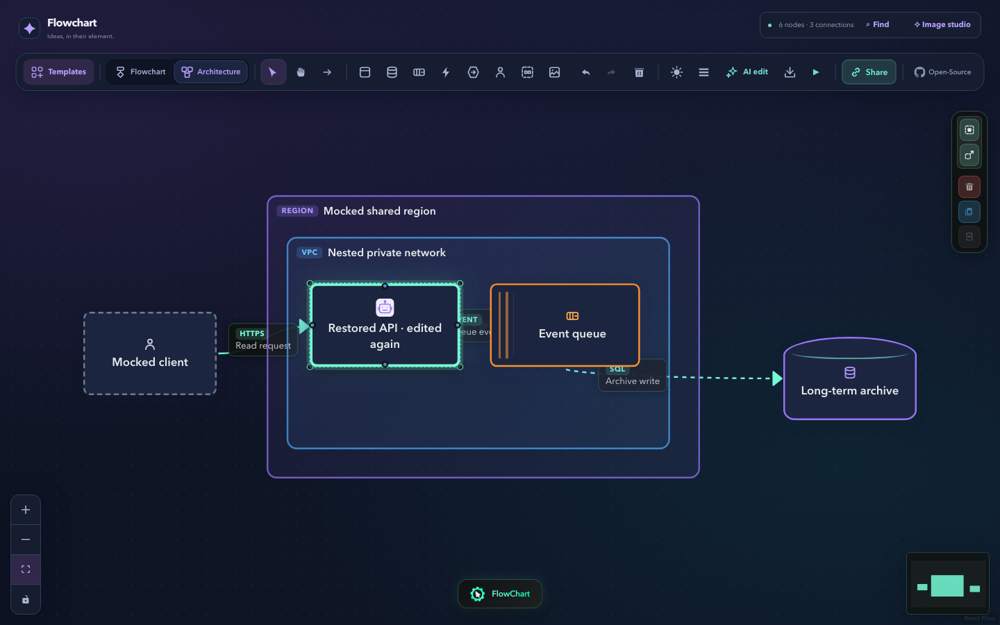
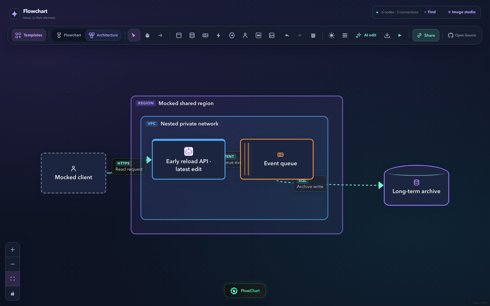

# Local-copy browser recovery evidence

Both repository Chromium regressions passed from a clean checkout of `6c07f0c5701f3f0b89d881b7298ae36db4d6478d` (tree `576e1d31b4ccf34aad01380335753043bf0c8910`) on 2026-10-02. The exact documented commands were `npm ci`, `npm run test:browser:install`, and `npm run test:browser`; each exited successfully. Runtime: Node v24.19.0, Playwright 1.63.0, bundled Chromium 153.0.8010.12.

The command compiled the website into `.browser-test-dist/`, served its owned loopback preview, ran two fresh contexts, and stopped that preview. Both receipts report a clean source checkout and matching served/local production bundle SHA-256 `40a0cb2a78162029d91b6927216cdbc6fed33390a06d0e7a1adbec5410289d60`. The ordinary preview and `dist/` stayed unchanged. The 52 existing local-copy and draft-recovery unit tests also passed.

## Saved copy, full reload, explicit restore, another edit

A naturally saved copy survives a new-document reload. Saved-draft preview and Restore remain explicit. Another native inline edit after restoration saves successfully. Deep draft equality and three actual downloaded exports verify the complete graph, including architecture mode, nested containers, geometry, the stable icon, edge handles/styles/protocols and communication styles.

[Actual receipt](full-reload-receipt.json) · [Final downloaded JSON](exports/restored-edited.json)

## Latest edit during early native unload

Storage still contained the exact older naturally saved draft immediately before native reload. The document request occurred **86.30 ms** after trusted Enter; the latest draft was naturally saved at **181.30 ms**, both before the source's 800 ms autosave delay. Browser timeline records preserve trusted old-document `pagehide` and hidden visibility observations. Explicit Preview and Restore recover the latest label and complete graph.

[Actual timing and lifecycle receipt](early-unload-receipt.json) · [Downloaded restored JSON](exports/latest-edit-restored.json)

Each case observes a real scheduled shared poll before detaching, then zero resumed API requests during two 3,000 ms polling windows both after detach and after Restore. All API transport is mocked or aborted without fallback; the graph, URLs and labels are synthetic. No draft storage is seeded, application timer replaced, lifecycle event synthesized or flush function called. Server title/ID/version/timestamps and private capabilities are outside the draft contract.

These receipts establish client persistence and detachment. They do not verify real remote persistence or provider calls. Screenshots are actual run evidence, not pixel snapshots. [Setup and recorder details](../../browser-tests.md) · [Artifact hashes](manifest.json)
