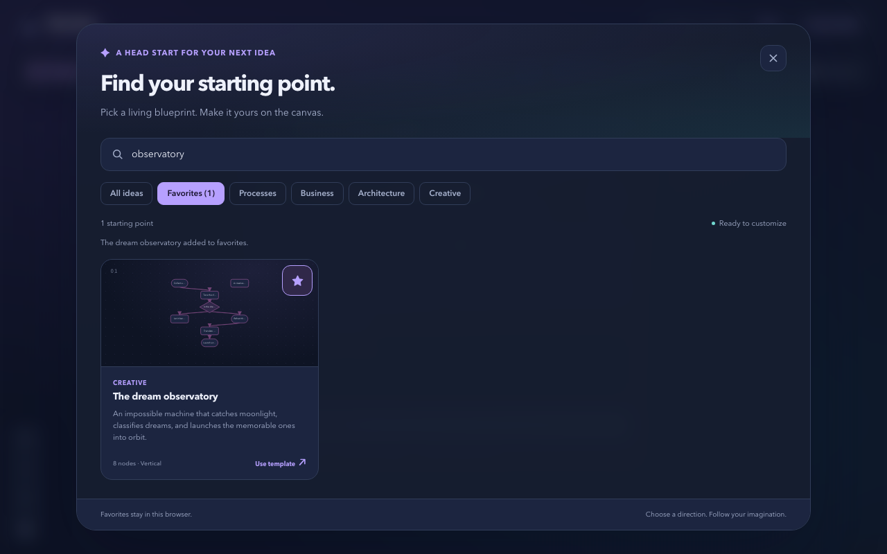
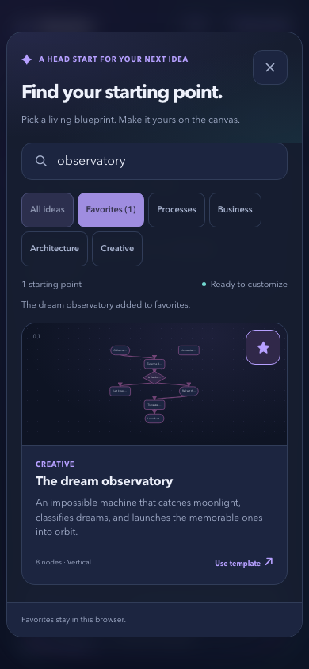
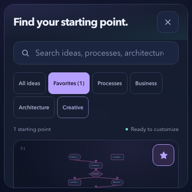
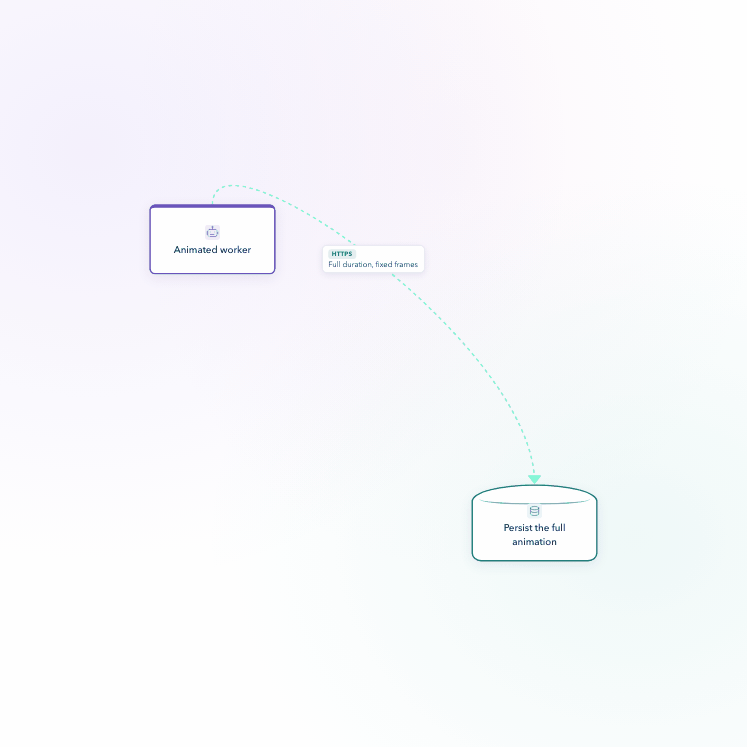
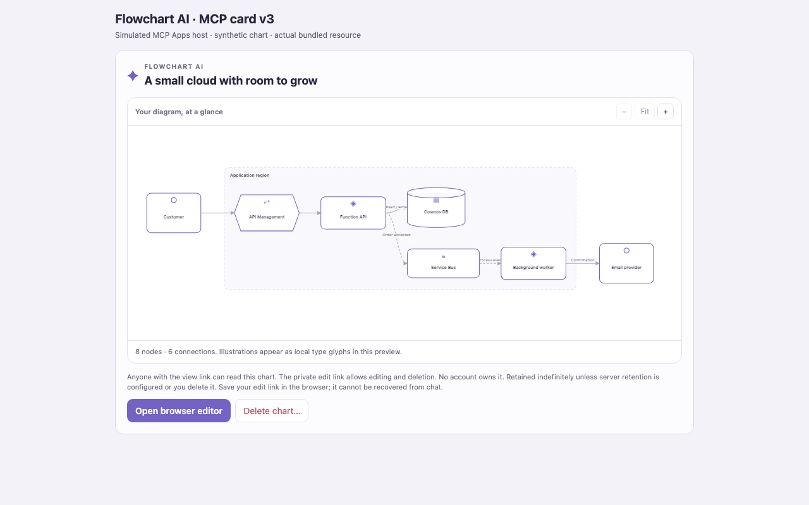
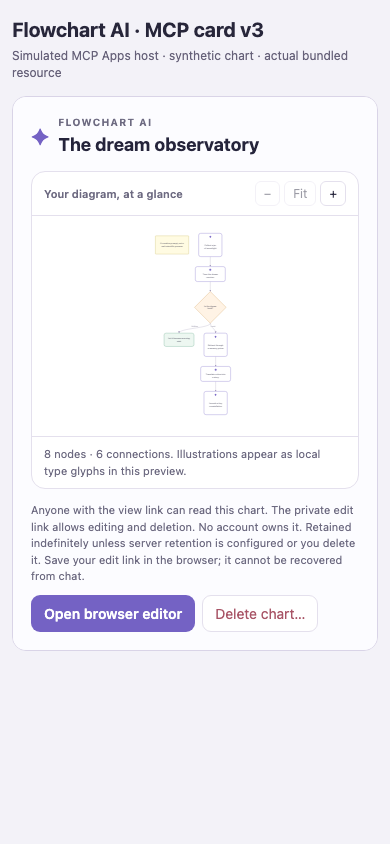

# v0.8 verification evidence

This candidate adds the diagram workspace, MCP card and Premium backend described in the PR. Screenshots were captured from local production output on October 2, 2026 and inspected for private identifiers. The source review and 800-test full suite passed at `778525fa5636a9249c4a85fe77ebfbfd6b880f84`. The subsequent evidence commit only adds these files and qualifies two historical trailer descriptions; application sources remain unchanged.

## Website and exports

Native Chromium checks passed template search, Favorites filtering and browser persistence, native Space activation, focus restoration, and responsive scrolling. Stars, Close and coarse-pointer category controls have 44-pixel targets. The short mobile gallery scrolls as a whole so its cards and controls remain reachable.

PNG, SVG and animated GIF downloads passed native Chromium and WebKit checks. Exports freeze theme and geometry without changing the live canvas, and dispose workers/buffers. GIF resolution adapts to a 64 MiB budget for copied RGBA frames, retaining 10 fps and the requested 1–10 second duration. This is a frame-buffer bound, not a claim about total browser memory. One real 3-second recording produced 30 frames at 747 × 747, 3,000 ms total and 66,961,080 copied RGBA bytes.

## MCP card

These screenshots explicitly use a **simulated MCP Apps host**, synthetic charts and the actual bundled v3 card. The installed SDK and real local HTTP discovery separately confirmed eight current tools and the exact v3 resource; disposable in-memory server transport supplied the chart results. Native zoom/Fit, editor-host requests and cancellation confirmation passed. Mobile has no horizontal overflow. This does not verify an installation inside ChatGPT.

## Payment and AI configuration

An isolated Stripe sandbox completed an actual hosted test payment, invoice, Customer Portal visit and cancellation lifecycle. Cleanup confirmed zero active subscriptions. Paid image entitlement, durable assets and same-request recovery were verified using controlled local image output. A real provider image request remains unverified because no OpenAI Images key is configured.

The website currently uses the operator's Azure deployment for diagram AI. Using each user's ChatGPT allowance requires approved hosted token-sharing configuration and explicit user consent; that route remains disabled. The documented preview does not support image generation. See [the implementation contract](../../chatgpt-plan-usage.md) and [Premium setup](../../premium.md).

Production hosting, actual ChatGPT staging installation and provider configuration remain release prerequisites. This PR merges into the `v0.8` feature branch. It does not deploy the site or merge into the default branch.

[evidence.json](evidence.json) binds the screenshots, production bundle and unchanged card hash to the reviewed source. Historical earlier screenshots and trailer footage should not be read as current same-chart MCP mutation support.
