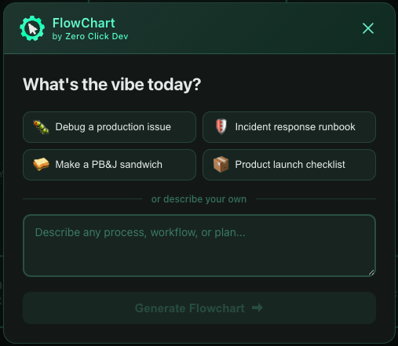
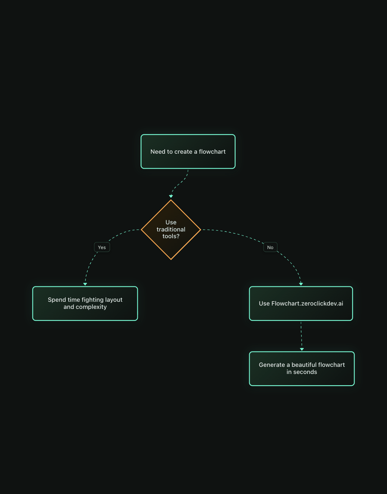
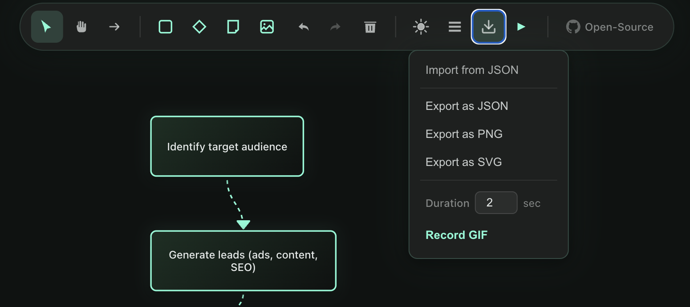

# I Mass-Deleted Every Flowchart App on My Laptop. Here's What I Built Instead.

_An open-source AI tool that turns plain English into polished flowcharts — and why I'm giving it away for free._

---

I want you to think about the last time someone asked you to "throw together a quick flowchart."

You opened a tool. You dragged a box. You dragged another box. You drew an arrow. It didn't connect right. You nudged it. You picked a color. You resized. You aligned. You second-guessed the layout. You started over.

Forty-five minutes later, you had something that looked like it was drawn by a caffeinated spider.

I've done this hundreds of times. Last month, in the middle of yet another meeting where I was the designated "can you diagram that?" person, I decided I was done.

That night, I started building **FlowChart AI**.


_The FlowChart AI home screen. Pick a preset or describe your own process._

---

## The Problem Nobody Solved

There are plenty of flowchart tools out there.

**Lucidchart.** Draw.io. **Miro.** Visio.

They all have one thing in common: they make _you_ do the work.

You're the one deciding where the boxes go. You're the one routing the arrows. You're the one picking between seventeen shades of blue for your decision nodes.

> **The actual thinking about the process — the part that matters — gets buried under UI busywork.**

I wanted a tool where I could just _say what I meant_ and get a diagram back.

---

## What I Built

FlowChart AI takes a plain-English description and generates a complete, editable flowchart.

That's the pitch.

Here's what it actually looks like in practice:

> **You type:** _"Show me the lifecycle of an API request from the client through authentication, rate limiting, and response handling"_
>
> **You get:** A structured flowchart with decision nodes, labeled connections, and proper flow — **in about three seconds.**


_From prompt to flowchart in seconds. No dragging. No aligning. No busywork._

But the part that surprised even me was the **refinement loop**. You can say "add error handling paths" or "make the auth section more detailed" and the AI keeps the full conversation context. It doesn't start over. It builds on what's already there.

> It's like pair-programming with someone who actually _enjoys_ making diagrams.

---

## What's Under the Hood

Here's every feature — and why it matters.

---

### 1. AI Generation + Refinement

Describe your process, then **iterate with follow-up prompts**. The AI keeps full conversation context so you can refine without starting over. Say "add a retry loop" or "break the auth section into substeps" and watch it update in place.


_Choose a starter template or write your own prompt from scratch._

---

### 2. Preview Before Commitment

Nothing touches your canvas without your approval. Every AI-generated change appears in a **preview dialog first**. You stay in control.


_Every AI suggestion shows in a preview dialog. Accept, regenerate, or edit — your choice._

---

### 3. 663+ Azure Icons — Auto-Applied

Building a cloud architecture diagram? FlowChart AI **automatically matches** the right icons to your nodes. Azure Functions, Cosmos DB, API Management — no manual selection required.

> **663 official Microsoft Azure icons.** Included. Automatic. Free.


_Cloud architecture diagrams get matching icons without lifting a finger._

---

### 4. Presentation Mode

Navigate through your flowchart **step-by-step** using arrow keys. Each node highlights in sequence. Perfect for:

- **Architecture reviews** — walk the team through system design
- **Meeting demos** — present a process without switching to slides
- **Teaching** — explain complex flows one step at a time


_Arrow keys move through the flow. No slides needed._

---

### 5. Export Everything

One click. Multiple formats:

- **PNG** — Drop into docs, Slack, emails
- **SVG** — Scalable graphics for presentations
- **Animated GIF** — Share process walkthroughs on social
- **JSON** — Version control, backup, team sharing


_Export in any format. No "upgrade to unlock" gates._

---

### 6. A Full Professional Editor

Snap-to-grid alignment. Undo/redo. Copy/paste. Minimap navigation. Multi-select. Dark mode. Multiple node types.

> **Everything you'd expect from a professional diagramming tool — without the professional price tag.**

---

## How I Built It (The Interesting Part)

The entire application was built using **AI-assisted development tools** — Cursor, OpenCode, Oh My Cursor.

I want to be transparent about that because I think it's worth talking about.

**The tech stack:**

```
Frontend:  React + TypeScript + ReactFlow + Vite
Backend:   Vercel serverless functions + Azure OpenAI
```

> **AI-assisted development doesn't mean "the AI wrote it and I watched."**
>
> It means the feedback loop between having an idea and seeing it work shrunk from hours to minutes.

I still made every architectural decision. I still debugged the weird edge cases. But the scaffolding, the boilerplate, the _"I know exactly what this function needs to do but I don't want to type it"_ parts — those went fast.

_Curious about the full development process? I wrote a [deeper dive on Medium](https://medium.com/@trent_78377/i-built-a-free-ai-flowchart-tool-heres-why-you-should-try-it-87c604a68057)._

---

## Why It's Free (And Open Source)

I've seen too many tools follow the same playbook:

1. Launch free
2. Build an audience
3. Gate every useful feature behind a paywall

**FlowChart AI won't do that.**

It's **MIT licensed**. The full codebase is on [GitHub](https://github.com/tmcfarlane/flowchart). And it will stay free.

No sign-up. No "free tier with limitations." No "enter your email to export."

You go to the site, describe your process, and get your flowchart. _That's it._


Why? Because I built this to solve **my own problem**. And I think the best way to make it better is to let other people use it, break it, and tell me what's missing.

---

## Try It Right Now

<div align="center">

### **[flowchart.zeroclickdev.ai](https://flowchart.zeroclickdev.ai)**

_No sign-up. No install. Just click and go._

</div>

**Need inspiration?** Try one of the starter prompts:

- CI/CD pipeline architecture
- Microservices request flow
- Customer onboarding process
- Hiring pipeline
- Incident response runbook

Or describe whatever process is living rent-free in your head.

---

## I Need Your Help

This isn't a launch-and-forget. I'm **building this in public** and your feedback directly shapes what gets built next.

**If you try it, I genuinely want to hear:**

> 1. What worked well?
> 2. What felt broken or confusing?
> 3. What feature would make this your go-to tool?
> 4. What would you use it for — documentation, meetings, teaching?

Reply to this post. Open a [GitHub issue](https://github.com/tmcfarlane/flowchart/issues). Drop a comment. Star the [repo](https://github.com/tmcfarlane/flowchart).

Every piece of feedback makes this tool better for everyone.

---

**If you found this useful, share it with someone who spends too much time making flowcharts by hand.**

They'll thank you.

_And if you want to follow along as I build — subscribe. The next update is going to be a big one._
